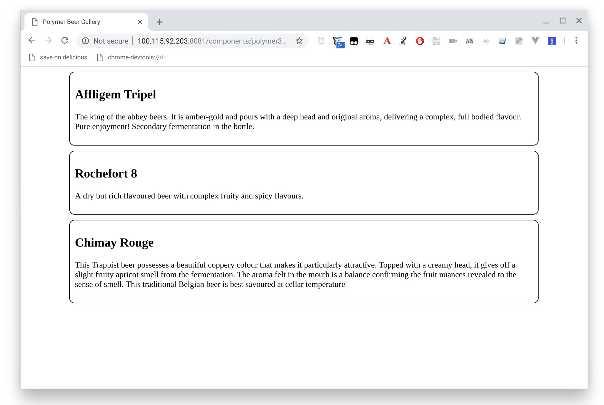

#  LitElement Beers - LitElement tutorial - Step 03

In this step we are going to create a more complex LitElement element, a custom `beer-list`.
This element will use a JavaScript array as model and automatically generate a `beer-list-item` for each beer in the array.


## Creating the element file

We begin by creating a new file for the element, `elements/beer-list.js`. Inside it we put a basic LitElement element definition:


```js
import { LitElement, html } from '../web_modules/lit-element.js';

class BeerList extends LitElement {

  static get properties() {
    return {  
    };
  }
  
  render() {
    return html`
    `;
  }
}

customElements.define('beer-list', BeerList);
```


## Defining the model

We are going to model our (ever growing) beer collection as a JavaScript array in our `beer-list` element.
We will use the element's `constructor`, that is often used to initialize variables.

```js
import { LitElement, html } from '../web_modules/lit-element.js';

const beers = [
  {
    alcohol: 8.5,
    name: "Affligem Tripel",
    description: "The king of the abbey beers. It is amber-gold and pours with a deep head and original aroma, delivering a complex, full bodied flavour. Pure enjoyment! Secondary fermentation in the bottle."
  },
  {
    alcohol: 9.2,
    name: "Rochefort 8",
    description: "A dry but rich flavoured beer with complex fruity and spicy flavours."
  },
  {
    alcohol: 7,
    name: "Chimay Rouge",
    description: "This Trappist beer possesses a beautiful coppery colour that makes it particularly attractive. Topped with a creamy head, it gives off a slight fruity apricot smell from the fermentation. The aroma felt in the mouth is a balance confirming the fruit nuances revealed to the sense of smell. This traditional Belgian beer is best savoured at cellar temperature "
  }
];

class BeerList extends LitElement {

  constructor(){
    super();
    this.beers = beers;
  }
  
  static get properties() {
    return {
      beers: {
        type: Array,
      }  
    };
  }

  render() {
    return html`
    `;
  }
}

customElements.define('beer-list', BeerList);
```


So now we have a `beers` property in our element, that can be access in the JS side using `this.beers` and in the `render()` side using  `${this.beers}`.

As you can see, for each beer we have the `name` and `description` properties that `beer-list-item` needs, and also added an `alcohol` property that our element isn't capable to use yet.


## Data-binding

A reasonable thing to do for our `beer-list` would be to spawn a `beer-list-element` for each beer in the `beers` array. How can we do that? 

Well, the template literal syntax used in the `render()` method is very flexible. To repeat a part of your HTML template, you can use a JavaScript expression to iterate over an array property:

```js
  render() {
    return html`
      <div class="container"></div>
        ${
          this.beers.map( (beer) => {
            return html`
              <beer-list-item name="${beer.name}" description="${beer.description}">
              </beer-list-item>
            `;
          })
        }
      </div>
    `;
  }
```

The [`map()`](https://developer.mozilla.org/en-US/docs/Web/JavaScript/Reference/Global_Objects/Array/map) array method creates a new array with the results of calling a provided function on every element in the calling array.

In this case, for each `beer` in the `beers` collection, it generates an `html` template fragment instantiating a `beer-list-item` element.

Don't forget to import `beer-list-item` in `beer-list`:

```js
import './beer-list-item.js';
```

## Using the new element

In the `index.html` file we aren't going to use directly `beer-list-item` elements anymore, but a simple `beer-list`.

Let's replace the import of `beer-list-item` by an import of `beer-list`:

```html
<!-- Import `beer-list` element -->
  <script type="module" src="./elements/beer-list.js"></script>
```

And use it in the body:

```html
  <beer-list></beer-list>
```

## Let's add some Bootstrap

We can now use [`granite-lit-bootstrap`](https://github.com/lostinbrittany/granite-lit-bootstrap) to add Bootstrap look and feel to your components.

Begin by installing `granite-lit-bootstrap`:

```
npm i @granite-elements/granite-lit-bootstrap
```

And run `@pika/web` to generate the modules for the browser:

```
npx @pika/web
```

Then import it in `beer-list` and `beer-list-item`:

```js
import bootstrapStyle from '../web_modules/@granite-elements/granite-lit-bootstrap.js';
```

and use `granite-lit-bootstrap` in the static `styles` property for both elements:


```js
  static get styles() {
    return bootstrapStyle;
  }
```

So now the beers are rendered inside a Bootstrap [container](https://getbootstrap.com/docs/4.1/layout/overview/#containers) element, as you can see with the margins.




## Aditionnal experiments

### Make the `beer-list` element show the number of beers in the list.

In the element's `template` you have access to the beers variable, you can then get it's size and show it after the beers:

```html
<div>Number of beers in list: ${beers.length}</div>
```

### Play with `dom-repeat`

Create a repeater in `beer-list` that constructs a simple table:

```html
<table>
  <tr><th>Row number</th></tr>
  ${[0, 1, 2, 3, 4, 5, 6, 7].map((item) => html`<tr><td>${item}</td></tr>`)}
</table>
```

Extra points: try and make an 8x8 table using an additional `dom-repeat`.

## Summary ##

You now have a web application using LitElement web components.
Now, let's go to [step-04](../step-04/) to learn how to add full text search to the app.
